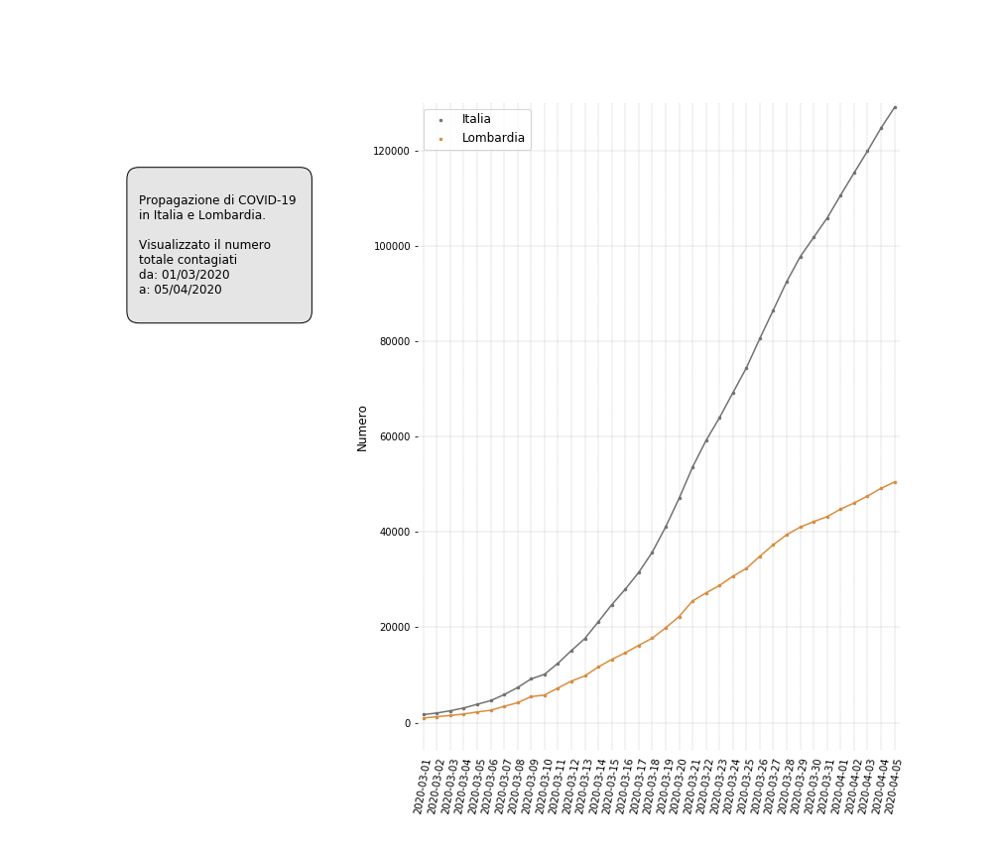

# CoronaVirus
This project contains a Jupyter notebook that creates some charts about the COVID19 spread in Italy.

The results are in this directory:
  - [images](./images)

## COVID-19 spread charts

## Disclaimer
I do know very well Pandas, Matplotlib and I had a fairly good education in statistics but, as all the programmers, I do bugs.
So beware, I have checked the results as carefully as I can but nevertheless do not take for granted my result, check by yourself my 
code and decide if it it is correct or not.
